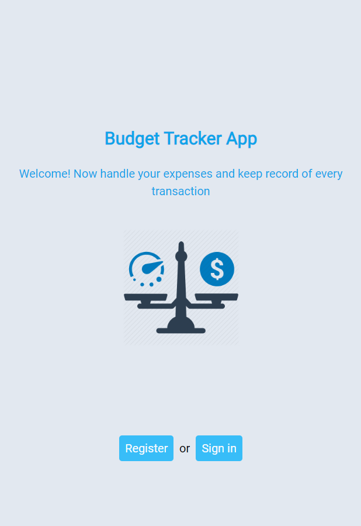
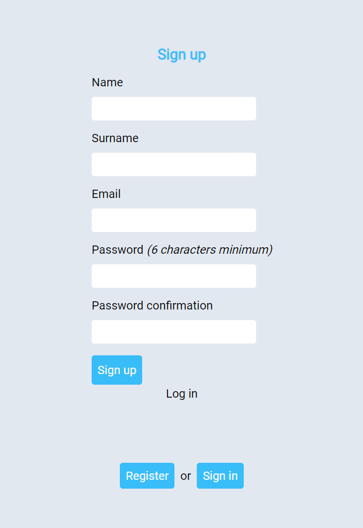
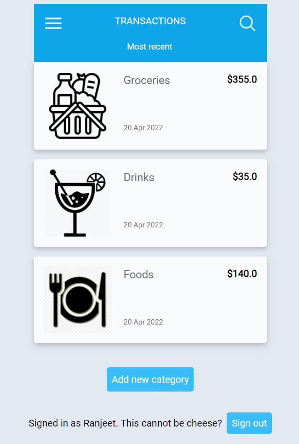
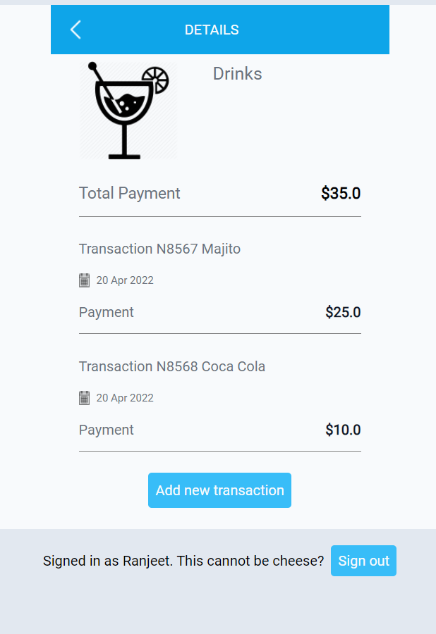
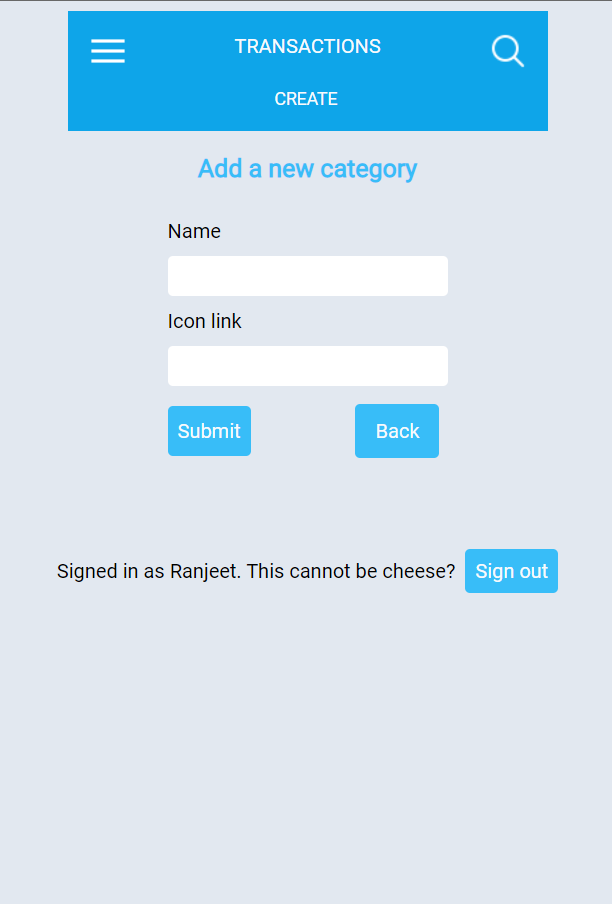

# Recipe-App

> The Budget tracker app is a full stack application. It's a functional website that shows the list of categories and transactions and empower readers to interact with them by adding new categories and transactions. Users can access the services of the application by creating a new account or by login in if they already have account.

## Preview

### Home Page



### Sign-up Page



### Category Page



### Transaction page



### Add category form



## Built With

- Major languages (Ruby)
- Framworks (Ruby on Rails)
- Testing libraries(Rspec)
- Markup (HTML)
- Styles (CSS, Tailwind)

## Live version

- Visit [Recipe-App](https://budget-tracker-thecodechaser.herokuapp.com/)

## Getting Started

To get a local copy up and running follow these simple example steps.

### Prerequisites
- A text editor(preferably Visual Studio Code)

### Install
- Ruby
- Ruby on Rails
- PostgresSQL
- Rspec

### Using it Locally

- Clone the project

```
git clone git@github.com:thecodechaser/budget-tracker.git

cd budget-tracker

```

### Setup

Install gems with:

```
bundle install
```

Setup database with:

```
rails db:create
rails db:migrate
```

### Usage

Start server with:

```
rails server
```

Visit http://localhost:3000/ in your browser.

### Run tests

Install npm with:

```
npm i
```

Install rspec with:

```
bundle install
```

and

```
rails generate rspec:install
```

run the test with:

```
rspec spec
```

### Open API documentation

```
Coming soon!
```


## Visit And Open Files

[Visit Repo](https://github.com/thecodechaser/budget-tracker)

## Download Repo

[Download Repo](https://github.com/thecodechaser/budget-tracker/archive/refs/heads/main.zip)


## Authors

👤 **Ranjeet Singh**

- GitHub: [@thecodechaser](https://github.com/thecodechaser)
- Twitter: [@thecodechaser](https://twitter.com/thecodechaser)
- LinkedIn: [thecodechaser](https://linkedin.com/in/thecodechaser)

## 🤝 Contributing

Contributions, issues, and feature requests are welcome!

Feel free to check the [issues page](https://github.com/thecodechaser/budget-tracker/issues).

## Show your support

Give a ⭐️ if you like this project!

## Acknowledgments

- Original design: [Gregoire Vella](https://www.behance.net/gregoirevella) on [Behance](https://www.behance.net/gallery/19759151/Snapscan-iOs-design-and-branding?tracking_source=)
- Inspiration: Microverse

## 📝 License

This project is [MIT](./LICENSE.md) licensed.
